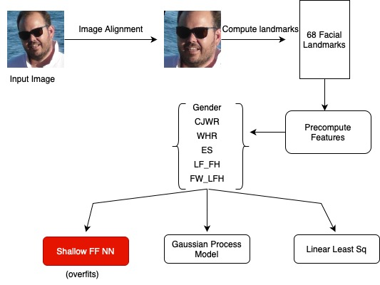

# CAIRE Assignment

## Overview

This repository contains the code for the CAIRE assignment. The code is written in Python and uses PyTorch for the deep learning model. The code is designed to predict BMI from facial images.

The overall architecture of the code is as follows:

The following steps were followed:
* Image Alignment: The images were aligned using the facial landmarks. This was done using the `face_alignment` library.
* Landmark Extraction: The facial landmarks were extracted using the `face_alignment` library.
* Feature Extraction: Following the approach in the [paper](https://pages.cs.wisc.edu/~gdguo/myPapers/BMIface2013.pdf), the facial features were extracted using the landmarks. These features were then normalized to have a mean of 0 and a standard deviation of 1. The BMI data was also normalized to have a mean of 0 and a standard deviation of 1.
* Models: Two models were trained, a linear model and a non-linear model. The linear model was trained using the least squares approach and the non-linear model was a feedforward neural network trained in PyTorch.

## Usage

To run the code, follow these steps:

1. Clone the repository
2. Download the image folder to `src/data/CodingImages` [OPTIONAL]
2. Install pypoetry using `pip install poetry`
3. Install the dependencies using `poetry install`
4. Activate the shell using `poetry shell`
6. Run the prediction using `python src/least_squares.py` (To run the linear model) or `python src/predict.py` (To run the non-linear model)

## Code Structure

The code is structured as follows:
* `src/least_squares.py`: Contains the implementation of the least squares model.
* `src/model.py`: Contains the implementation of an experimental CNN based model.
* `src/shallow_model.py`: Contains the implementation of the shallow feedforward neural network.
* `src/train.py`: Contains the implementation to train the CNN model.
* `src/train_shallow_model.py`: Contains the implementation to train the shallow feedforward neural network.
* `src/data/dataloader.py`: Contains the implementation to load the data for the CNN model.
* `src/data/dataloader_shallow_model.py`: Contains the implementation to load the data for the shallow feedforward neural network.

## Models

The models are saved in the `models` folder. `final_model.pth` is the non-linear model. For least squares, the coefficients are printed in the terminal.

## Additional Experiments

Additionally a CNN based architecture was also tried. However, it performed poorly and hence was not included in the final version.

## Results

The results are there in the results folder. `predicted_bmi_least_squares.csv` has the predictions of the least squares model. `predicted_bmi.csv` has the predictions of the feedforward neural network.

## NOTE

The code is highly unoptimized and can be further improved. It was largely in research mode.